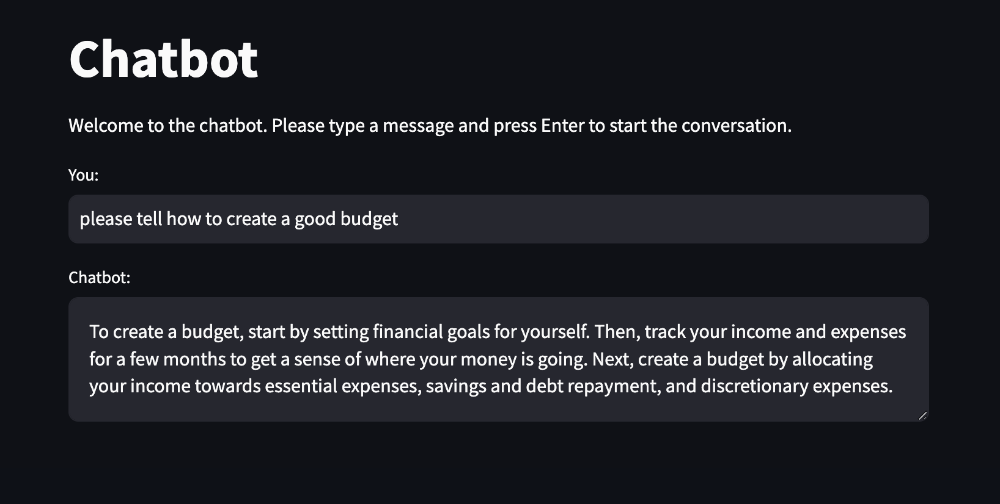

# End-to-End Chatbot Using Python

This repository contains a project to build an **End-to-End Chatbot** using Python. The chatbot leverages **Natural Language Processing (NLP)** and machine learning to provide interactive and intelligent conversations. It includes components for text preprocessing, intent recognition, response generation, and deployment.

## 📌 Overview

Chatbots are increasingly essential for automating interactions in customer support, e-commerce, and more. This project demonstrates the step-by-step development of a chatbot, from text preprocessing to deployment, ensuring robust and context-aware interactions.

## 💡 Key Features

- **Intent Recognition**:
  - Classifies user input to determine the intent.
- **Response Generation**:
  - Rule-based or machine learning-based response generation.
- **Text Preprocessing**:
  - Tokenization, stemming, and lemmatization.
- **Machine Learning Integration**:
  - Use models like Logistic Regression or TensorFlow/Keras for training.
- **Deployment-Ready**:
  - Deploy the chatbot locally or on a web application using Flask or Streamlit.

## 🚀 Technologies Used

- **Python**: Core programming language.
- **Libraries**: NLP: NLTK, Scikit-learn, Streamlit.
- **Development Tools**: Jupyter Notebook.

## 📂 Project Structure

```
├── image/
│   ├── chatbot_app.png
├── notebooks/
│   ├── chatbot_app.ipynb            
│   ├── chatbot_app.py    
```

## 📊 Example Results

### Sample Conversation



## 🛠️ Installation

1.	Clone the repository:
   
```bash
git clone https://github.com/yaserselvam/End-to-End-Chatbot.git
cd End-to-End-Chatbot
```

2.	Run the Jupyter Notebooks:

```bash
jupyter notebook
```

3. Deploy using streamlit:

```bash
streamlit run chatbot_app.py
```

## 📚 Usage

1.	Define your intents.
2.	Use the **Text Preprocessing notebook** to clean and prepare text data.
3.	Train the intent classification model using **Model Training notebook** or train.py.
4.	Test the chatbot locally with chatbot.py or deploy it using the Flask app.

## 📈 Future Enhancements

- Integrate a database for storing and managing user interactions.
- Expand functionality with pre-trained LLMs like OpenAI’s GPT.
- Enable multilingual support for broader audience interaction.
- Add voice input/output capabilities for a voice-enabled chatbot.

## 💌 Contact

If you have any questions or suggestions, feel free to reach out:
- Name: Yaser Selvam
- Email: yaseruk259@gmail.com
- LinkedIn: [Connect with me on LinkedIn](https://www.linkedin.com/in/yaserselvam)
- GitHub: [Visit My GitHub Profile](https://github.com/yaserselvam)
